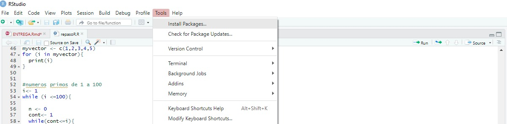
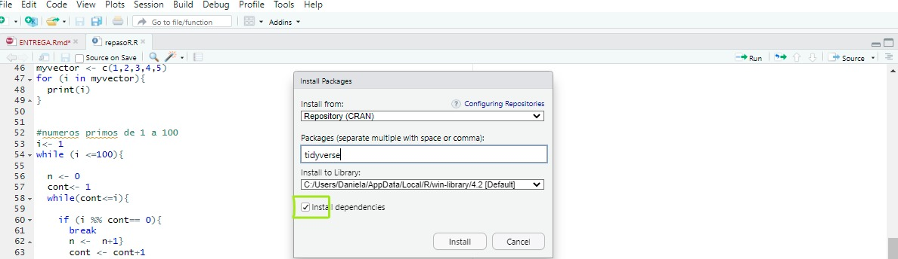
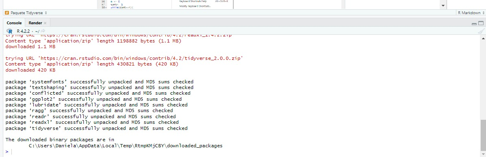

## 1. Codificación básica en R.

1.  Realizamos un Script en R en donde se imprimen los números primos del 1 al 100. A continuación se muestra el desarrollo del código:

```{r, echo=TRUE}
num <- 100L
  prime_nums <- c()
  for (i in 2:num) 
    {
    is_prime <- TRUE
    for (j in prime_nums) {
      if (j > sqrt(i)) {
        break
      }
      if (i %% j == 0) {
        is_prime <- FALSE
        break
      }
    }
    if (is_prime) {
      (prime_nums <- c(prime_nums, i))
      
    }
  }
  print(prime_nums)
```

## 2. Paquete Tidyverse

Tidyverse es un paquete en R, que esta diseñado para ayudar en el proceso de transformación de datos. Esto es algo muy útil en la ciencia de datos ya que nos ayuda a realizar un análisis y manipulación de los datos cuando se requiera.(Rafa, 2020).

Ahora vamos a mostrar como se debe realizar la instalación del paquete en RStudio. Primero debemos ir a Tools y en la opción de Install Packages como se muestra en la imagen:



Después de seleccionar esta opción nos sale la siguiente ventana, y en la casilla debemos escribir Tidyverse, y tener seleccionada la casilla de install Dependencies, y le indicamos en Install.



Cuando se haya instalado nos aparecera un mensaje en la consola:



Una vez instalado el paquete, en el nuevo Script debemos cargar la libreria para que podamos usar las funciones del paquete.

```{r setup, include=FALSE}
knitr::opts_chunk$set(echo = TRUE)
library(nycflights13)
library(tidyverse) #se cargan las librerias


```

Ya cargada la librería podemos empezar a usar las funciones. Para este caso vamos a usar el paquete dplyr, que es otro miembro central de Tidyverse. Se carga también el paquete de nycflights13 en donde nos muestra un marco de base de datos de 336.776 vuelos que se registraron en 2013 que partieron desde la ciudad de New York. Con este marco de datos empezaremos a usar las funciones que son claves para realizar la manipulación de los datos mostrando algunos ejemplos.(Wickham,H. Grolemund,G).

```{r}
nycflights13::flights
```

1.  **Función Filter**, Usando la función de filtrer realizar los siguientes ejercicios:

-   Encontrar los vuelos que tuvieron retraso de llegada de dos o mas horas

```{r}
library(tidyverse)
library(nycflights13) #se cargan las librerias
filter(flights,arr_delay>=120)

```

Para este punto lo que se realiza es un filtrado de los vuelos que tuvieron un retraso de llegada de dos o mas horas, por eso se coloca el mayor o igual y como la data esta en minutos por eso se coloca 120 minutos.

-   Vuelos con destino a ( IAH o HOU)

```{r}
filter(flights,dest =="IAH" | dest== "HOU")%>%
  select(dest)   #Colocamos la función select para que nos aparezca solo la columna que acabamos de 
#filtrar anteriormente
```

Podemos ver que los vuelos se filtran con los destinos corrrespondientes, en este caso para cada destino se utilizan esas abreviaturas y se usa la operación de "\|" para que filtre el destino de los dos.

-   Fueron operados por United, American o Delta

```{r, echo=TRUE}
filter (flights, carrier =="DL" | carrier=="UA" | carrier =="AA" )%>%
select(carrier)
```

En este punto se realiza el filtrado de las operadoras correspondientes, por lo que se utiliza la función "\|" que es una ccondición de "o" para que nos seleccione alguna de las tres operadoras.

-   Salida en verano (julio, agosto y septiembre)

```{r, echo=TRUE}
filter( flights, month %in% c(7,8,9))

```

Se realiza el filtrado de los meses correspondiente al mes de julio, agosto y septiembre, en este caso podemos ver que usamos el comando %in%, a lo que se refiere es que hace una coincidencia del valor, toma los datos de la varibale month correspondientes a los meses que se filtraron.

-   Llegó más de dos horas tarde, pero no se fueron tarde.

```{r, echo=TRUE}
filter (flights, dep_delay <=0 & arr_delay>120)

```

En este caso realizamos el filtrado de los vuelos que llegaron dos horas tarde pero adicional a eso los que no se fueron tarde, por eso es necesario utilizar el operador "&" para que se filtre las dos condiciones.

-   Se retrasaron al menos una hora, pero recuperaron más de 30 minutos en vuelo

```{r, echo=TRUE}
filter(filter(flights, dep_delay>=60 & arr_time-arr_delay>30))
```

-   Salida entre la medianoche y las 6 a. m.

```{r, echo=TRUE}
filter (flights, hour>=0 & hour<=6)%>%
  select(flight:minute)
```

En este caso lo que se realiza es que se filtra la hora, que es la hora programada que tenía las salidas de los vuelos, se filtra entre las 0 horas y las 6 horas.

-   Otro útil ayudante de filtrado de dplyr es between(). ¿Qué hace? ¿Puedes usarlo para simplificar el código necesario para responder a los desafíos anteriores?

```{r, echo=TRUE}
filter(flights,between(hour,0,6))
filter(flights,between(month,7,9))
```

La función between sirve cuando queremos realizar un filtrado de una variable entre algunos valores, lo que se le da son limites hacia la derecha o izquierda, como en el ejemplo, en el que se filtra la variable hour, entre las 0 y 6 horas y el mes entre el mes de Julio y septiembre.

2.  **Función Arrange**, realizar los siguientes ejercicios:

-   ¿ Cómo podría utilizar arrange()para ordenar todos los valores que faltan al principio? (Sugerencia: use is.na()).

```{r, echo=TRUE}
arrange(flights,desc(is.na(dep_time)))
```

En esta función con el desc(), lo que realiza es que toma primero los valores mas altos al inicio, en este caso se ordena la variable dep_time, y adicional a eso nos indica que se deben colocar al inicio los que le faltan este valor, por eso se utilia is.na(), para que coloque los que no tienen algun valor en la variable.

-   Ordenar flights para encontrar los vuelos más retrasados. Encuentra los vuelos que salieron antes.

```{r, echo=TRUE}
arrange(flights, desc(dep_delay))

```

Se ordenan los datos de forma descendente para que nos muestre primero los vuelos que tuvieron mas retraso en la salida.

```{r, echo=TRUE}
arrange(flights, dep_delay)
```

En este caso, solo se coloca la función arrange y nos va a mostrar los vuelos que salieron antes de la hora programda.

-   Ordenar flights para encontrar los vuelos más rápidos (velocidad más alta).

```{r, echo=TRUE}
arrange (flights, desc(distance/air_time))
```

En este caso se realiza la división entre la distancia y el tiempo de vuelo ya que esto correspondería a la velocidad con la que viajo cada vuelo y con la función arrange nos organiza de forma ascendente el vuelo que tuvo mas velocidad.

-   ¿Qué vuelos viajaron más lejos?, ¿Cuál viajó menos?

```{r, echo=TRUE}
arrange(flights, desc(distance))
arrange(flights, distance)
```

3.  **Función Select**, Realizar los siguientes ejercicios

-   Qué sucede si incluye el nombre de una variable varias veces en una select()llamada?

```{r, echo=TRUE}
select(flights, dest,dest,dest,dest)
```

Lo que pasa es que la función select no duplica la misma variable las veces que se coloque en la función, solo la deja una vez ya que se esta selecionando la misma.

-   Qué hace la any_of()función? ¿Por qué podría ser útil junto con este vector?

```{r, echo=TRUE, message=TRUE}
vars <- c("year", "month", "day", "dep_delay", "arr_delay")
select(flights, any_of(c("dep_time", "dep_delay", "arr_time", "arr_delay")))

```

Podemos ver que la función any_off lo que hace es guardar en una variable, en este caso el vector, solo las varibales que se necesitan guardar y usarlos mas adelante en alguna función de select.

-   ¿Te sorprende el resultado de ejecutar el siguiente código? ¿Cómo tratan los ayudantes selectos el caso de forma predeterminada? ¿Cómo se puede cambiar ese valor predeterminado?

```{r, echo=TRUE}
select(flights, contains("TIME"))
```

Se observa es que este codigo lo que hace es seleccionar todas las varibales que en su mombre contenga la palabra TIME.

4.  **Función Mutate y Transmutate**, Realizar lo siguientes ejercicios

-   Actualmente dep_timey sched_dep_time son convenientes a la vista, pero difíciles de calcular porque en realidad no son números continuos. Conviértalos a una representación más conveniente de la cantidad de minutos desde la medianoche.

```{r, echo=TRUE}
transmute(flights, dep_time,
  minutos_deptime = (dep_time %/% 100 * 60 + dep_time %% 100) %% 1440,
  sched_dep_time,
  minutos_sched = (sched_dep_time %/% 100 * 60 +
    sched_dep_time %% 100) %% 1440
  )
```

La función mutate lo que realiza es que se pueden realizar operaciones entre las variables y ese resultado se puede asignar a una variable nueva, y esa varibale se va a ver al final de todas las variables.

Para la función transmute hace dos funciones en una sola, ya que funciona como un select, selecciona las variables que queremos que queden y asi mismo podemos manipular esas variables para crear una nueva, que sería la función que cumple el mutate.

-   Comparar air_time con arr_time - dep_time. Que esperas ver? ¿Que ves? ¿Qué necesitas hacer para arreglarlo?

```{r, echo=TRUE}
transmute(flights, air_time_diff = air_time - arr_time + dep_time)
```

Lo que se esperaría ver de la resta de estas dos variables es que debería dar el tiempo que duro el vuelo.

5.  **Función Summarise**, Haga una lluvia de ideas sobre al menos 5 formas diferentes de evaluar las características típicas de retraso de un grupo de vuelos. Considere los siguientes escenarios:

-   Un vuelo llega 15 minutos antes el 50% del tiempo y 15 minutos tarde el 50% del tiempo.
-   Un vuelo siempre llega 10 minutos tarde.
-   Un vuelo llega 30 minutos antes el 50% del tiempo y 30 minutos tarde el 50% del tiempo.
-   El 99% de las veces un vuelo es puntual. El 1% de las veces llega 2 horas tarde.

6.  **Mutaciones agrupadas (y filtros)**, Realizar el siguiente ejercicio: ¿Qué avión ( tailnum) tiene el peor récord de puntualidad?

```{r}
table <- flights %>%
    filter(!is.na(tailnum)) %>%
    mutate(on_time = !is.na(arr_time) & (arr_delay <= 0)) %>%
    group_by(tailnum) %>%
    summarise(on_time = mean(on_time), n = n()) %>%
    filter(min_rank(on_time) == 1)
    print(table)
    
    part_1 <-flights %>%
    filter(!is.na(tailnum), is.na(arr_time) | !is.na(arr_delay)) %>%
    mutate(on_time = !is.na(arr_time) & (arr_delay <= 0)) %>%
    group_by(tailnum) %>%
    summarise(on_time = mean(on_time), n = n()) %>%
    filter(n >= 20) %>%
    filter(min_rank(on_time) == 1)
    print(part_1)
    
    #part(2)
    part_2 <- flights %>%
    filter(!is.na(arr_delay)) %>%
    group_by(tailnum) %>%
    summarise(arr_delay = mean(arr_delay), n = n()) %>%
    filter(n >= 20) %>%
    filter(min_rank(desc(arr_delay)) == 1)
    print(part_2)
```

## 3. Informes con Rmarkdown

Como sabemos el paquete dplyr es una librería que se utiliza para la manipulación y transformación de datos de una manera eficiente. Para poder comenzar a utilizar estos verbos, tendremos que tener un conjunto de datos a los que podamos acceder a ellos, es por esto que empezaremos instalando y llamando a la libreria "nycflight13"; después de esto procederemos a cargar la librería "tidyverse". Esta librería es la que almacena los verbos.

```{r include=TRUE}

library(nycflights13)             #cargamos el paquete con los datos
library(tidyverse)                #cargamos el paquete tidyverse

data("flights")                   #cargamos los datos al entorno
head("flights")                   #generamos la tabla de los datos

```

Luego de haber instalado y llamado a las librerias procederemos a cargar y generar la tabla "flights", esta es un compilado de datos acerca de los vuelos que se realizaron en el año 2013; pero no se utilizaran todos los datos de todo el año, nos basaremos en los datos del segundo mes (febrero) de el dia 16 y el antepenultimo mes del año (noviembre) de el dia 16.

```{r}
feb16 <- filter(flights,month ==2, day == 16)
nov16 <- filter(flights,month ==11, day ==16)
```

## Summarise()

Es una función que se utiliza para agregar datos en un conjunto de datos mas pequeños. Es utilizado para calcular estadísticas de resumen para diferentes grupos en un conjunto de datos, su sintaxis se muestra a continuación:

summarise(data, summary_statist = function(variable))

en donde "data" es el conjunto de datos que se desea resumir, la sección "summary_statistic" es la estadística de resumen que se desea calcular(por ejemplo, la media, mediana, etc ) y la "variable" es la variable para la que se desea calcular la estadística del resumen.

## Group_by()

Para poder utilizar este verbo también tendremos que utilizar otro verbo para que nos ayude y es el group_by, el cual su función es para agrupar un conjunto de datos por una o más variables, una vez se ha agrupado el conjunto de datos , se puede aplicar la funcion de resumen a cada grupo por separado, es decir la función summarise(), su sintaxis es la siguiente:

group_by(data, variable)

donde "data" encontramos el conjunto de datos que queremos agrupar y "variable" son las variables que se desean agrupar.

## Arrange()

Esta función se utiliza para ordenar filas de un conjunto en base a una o varias columnas, su sintaxis general de esta función es:

arrange(data, columna1, columna2. ...)

Donde "data" es el conjunto de datos que se desea ordenar y el grupo "columnas", son las columnas por las que se desea ordenar.

despues de tener este abrebocas explicando las anteriores funciones, podremos ver en ejemplos de como funciona. En este ejemplo que se realizó de las tablas de (feb16 y nov16) solo hicimos uso de algunas columnas esto para poder organizar de una forma descendente la distancia de cada vuelo.

```{r}
feb16_2 <- select(feb16,month,day,flight,distance,hour) #escoge solo las columnas escritas dentro del select
arrange(feb16_2, desc(distance)) #organiza los valores de distancia de mayor a menor del 16 de febrero
```

```{r}
ejem_arran <- arrange(feb16_2,desc(distance)) #crea la tabla 
```

```{r}
nov16_2 <- select(nov16,month,day,flight,distance,hour) #escoge solo las columnas escritas dentro del select
```

```{r}
arrange(nov16_2, desc(distance))  #organiza los valores de distancia de mayor a menor del 16 de febrero
```

```{r}
ejem_arran <- arrange(nov16_2,desc(distance))

```

### 4.GitHub -- Integración de paquetes R

Entrar al siguiente enlace para ingresar al repositorio.

<https://github.com/Khallavan/classworkPackage>
